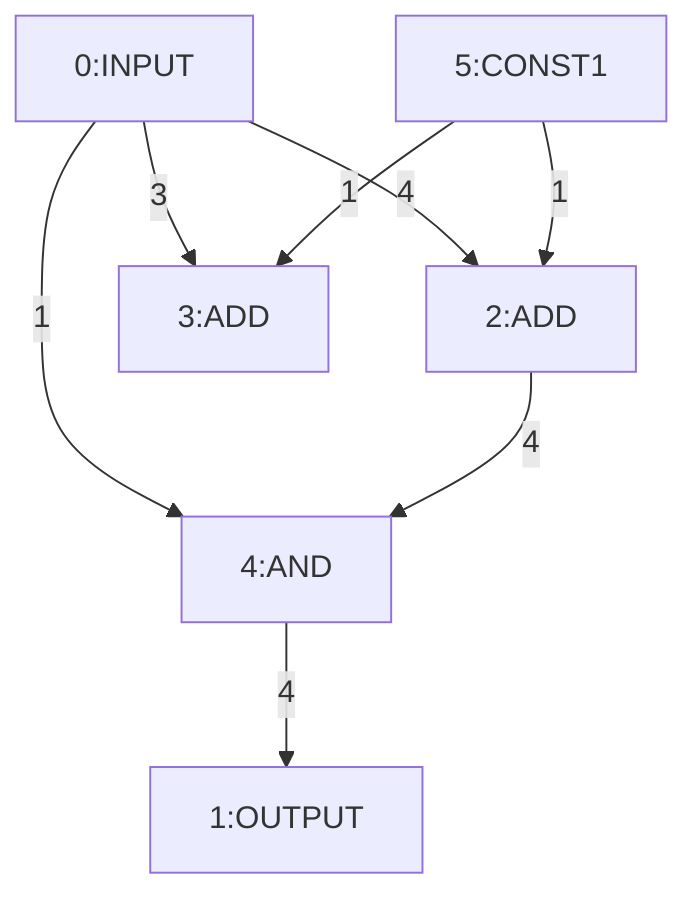

# CS224W Final Project

# Setup

1. Install Docker
2. Run `make init` to install the dependencies and build the OpenLane environment

# Dataset

1. Create a new design directory in `designs/`
2. Inside the design directory, create folders with the test case IDs
   For example, `designs/0`, `designs/1`, etc.
3. Inside each test case directory, create a `top.sv` file with the RTL code
   The `design` folder will look like this:

```
designs/
├── 0
│   └── top.sv
├── 1
│   └── top.sv
```

4. Run `make run DESIGN_ID=<test_case_id>` to run the OpenLane flow
5. The PPA metrics will be saved in `designs/<test_case_id>/metrics.csv`

# Data Preprocessing

1. Run `python3 src/data/gen_rtl.py` to generate the RTL code for the design
2. Copy the RTL code to `designs/<test_case_id>/top.sv`
3. Run `make run DESIGN_ID=<test_case_id>` to run the OpenLane flow. The PPA metrics will be saved in `designs/<test_case_id>/metrics.csv`
4. Run `python3 src/data/gen_net.py` to generate the netlist for the design. Remember to change the design ID in the script.
5. (Optional) Run `python3 src/utils/view_net.py` to view the netlist. Remember to change the design ID in the script.
6. Run `python3 src/data/net_to_graph.py` to convert the netlist to a PyG graph. Remember to change the design ID in the script. The graph will be saved in `designs/<test_case_id>/graph.png`

# Netlist Graph

## Node Types

The node types are:

1. $add
2. $and
3. $eq
4. $ge
5. $gt
6. $le
7. $logic_not
8. $lt
9. $mul
10. $mux
11. $ne
12. $neg
13. $not
14. $or
15. $reduce_bool
16. $reduce_or
17. $shl
18. $shr
19. $sub
20. $xor
21. CONST0
22. CONST1
23. INPUT
24. OUTPUT
25. UNKNOWN

Node feature is a one-hot encoding (dim=25) of the node type.

## Edge Features

Edge feature is the width of the edge (dim=1).

## Example (See `examples/net.json` and run `python3 src/data/load_net.py`)


